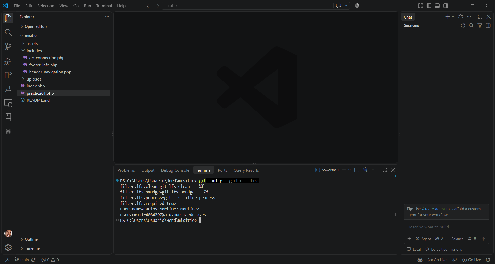
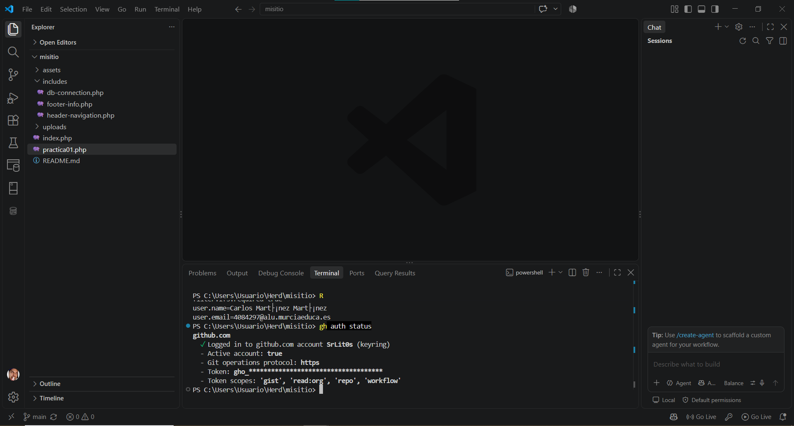
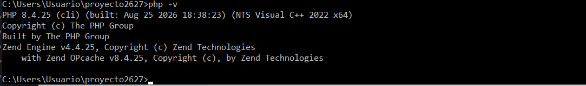
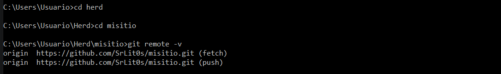
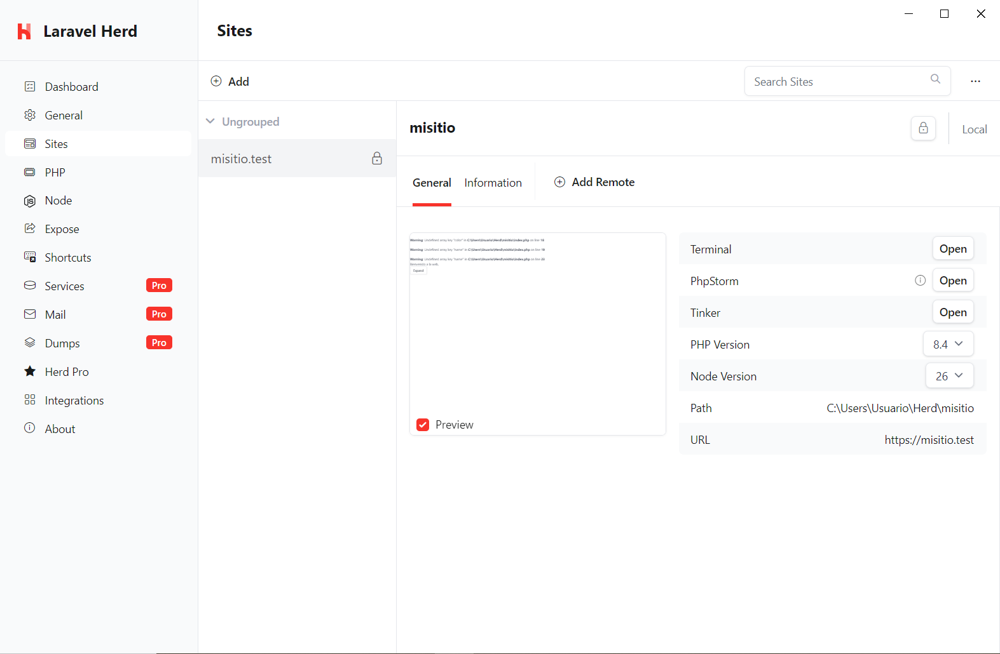

# Instalación y configuración local con ProperDocs

## 1. Git instalado y configurado

Ejecuto el comando: "git config --global --list", en el terminal del VSCode.



## 2. GitHub CLI configurado

Se instaló GitHub CLI y se comprobó la autenticación con:
R
```bash
gh auth status
```



## 3. Herd con PHP 8.4

Se instaló Herd y se seleccionó la versión PHP 8.4.



## 4. Repositorio clonado

Se clonó el repositorio `misitio` en local:

```bash
git remote -v
```



## 5. Sitio enlazado y servido con HTTPS

Se enlazó la carpeta `misitio` con Herd y se comprobó que el sitio se sirve mediante HTTPS.



## Resumen de Read the Docs

Se utilizaron títulos, texto, bloques de código e imágenes Markdown. Read the Docs aporta el tema, la navegación y la organización de la documentación. No se necesitan plugins adicionales para este contenido.
